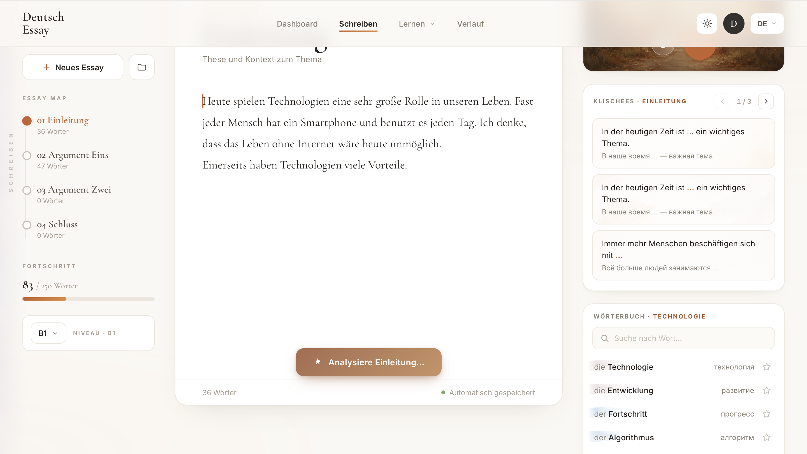
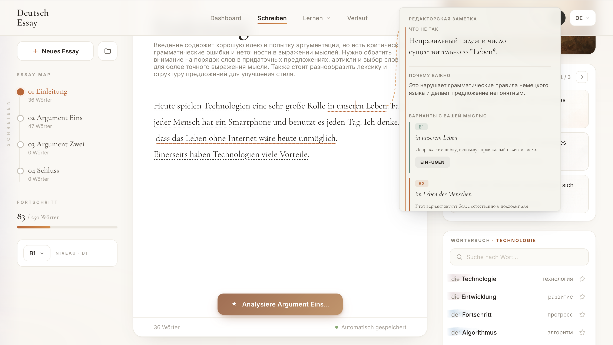
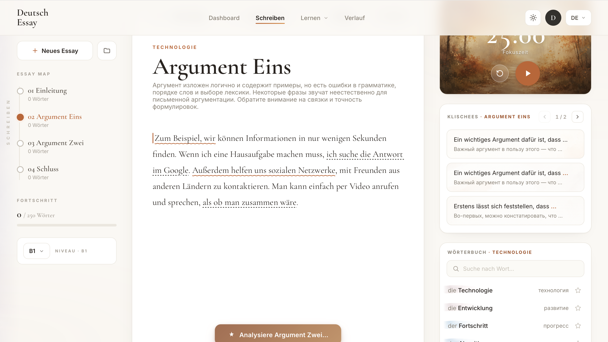
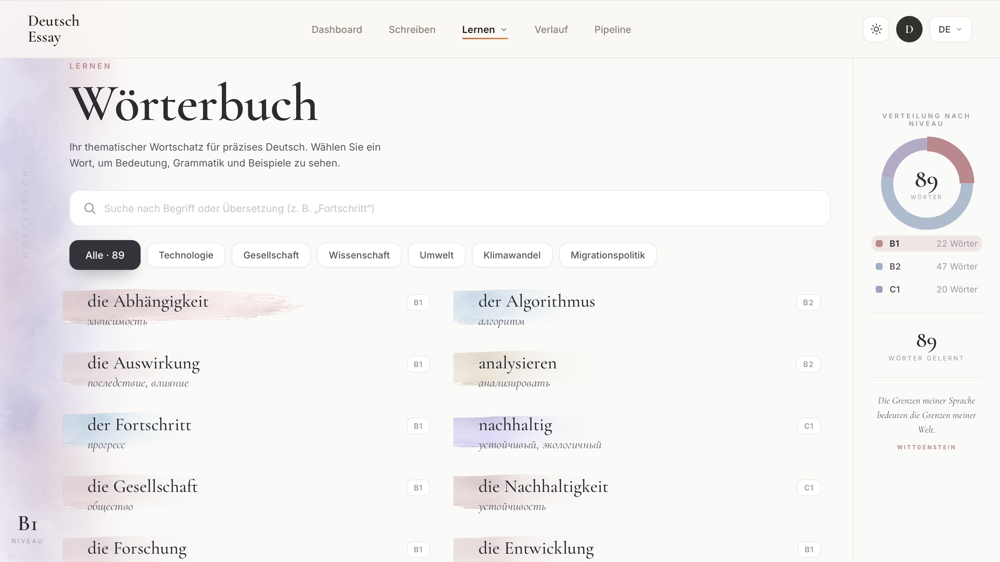
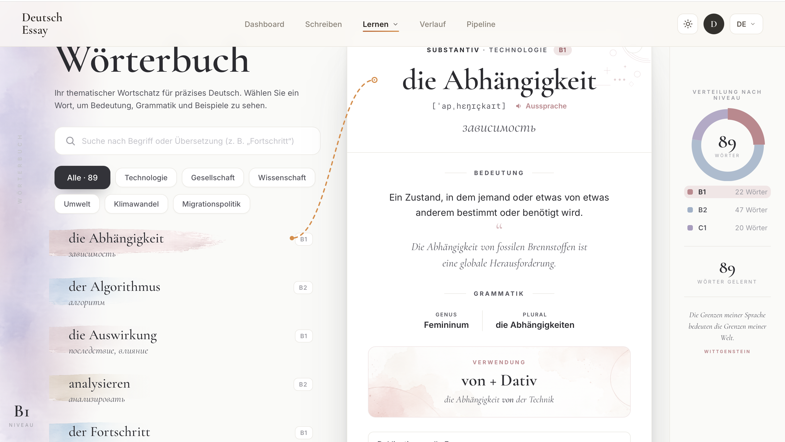
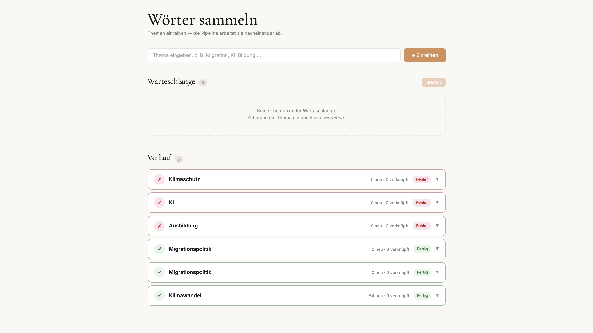

# Deutsch Essay Trainer

Full-stack прототип тренажёра немецкого: тематический словарь B1–C1, AI-редактор эссе и pipeline автоматического обогащения слов по теме.

**Репо:** https://github.com/NeverLucky-DS/wordlist-design

Пет-проект уровня production-prototype: REST API, PostgreSQL, LLM-интеграция, тесты.

| Навык | Реализация |
|-------|------------|
| Python | backend, pipeline |
| FastAPI | REST API, SSE-стриминг, OpenAPI |
| PostgreSQL | слова, эссе, фразы, прогресс pipeline |
| Тесты | pytest — 16 тестов (`backend/tests/`) |
| LLM / агенты | Mistral (анализ эссе, enrichment) · Grok (discovery) |
| Async | SQLAlchemy async, httpx, `asyncio.gather` |
| Docker | docker-compose: nginx + FastAPI + PostgreSQL |

---

## Демонстрация

### Редактор эссе

Структура из четырёх разделов, тематический словарь, клише по секциям, Pomodoro и AI-анализ текста.





### AI-разбор текста

Streaming-анализ с подсветкой ошибок, объяснениями на русском и вариантами B1/B2.





### Словарь (Wörterbuch)

Тематические фильтры, watercolor-карточки по уровню CEFR, детальная карточка с грамматикой и статистикой.





### Pipeline обогащения слов

Очередь тем: discovery → extraction → enrichment → запись в БД.



---

## Быстрый старт

```bash
export MISTRAL_API_KEY=...   # AI-анализ эссе
export GROK_API_KEY=...      # discovery в pipeline

docker compose up --build
```

| Страница | URL |
|----------|-----|
| Словарь | http://localhost:8753 |
| Редактор | http://localhost:8753/editor.html |
| Pipeline | http://localhost:8753/pipeline.html |
| API docs | http://localhost:8000/docs |

---

## Архитектура

```
index.html / editor.html / pipeline.html
              ↓  /api/*
           nginx → FastAPI → PostgreSQL
              ↓
     Mistral (анализ, enrichment) · Grok/DuckDuckGo (discovery)
```

Подробнее: [`PIPELINE.md`](PIPELINE.md)

---

## Тесты

```bash
cd backend && pip install -r requirements.txt && pytest -v
```

Покрыто: CRUD эссе, SSE-fallback, фильтры слов/фраз, pipeline API и routing по теме.
